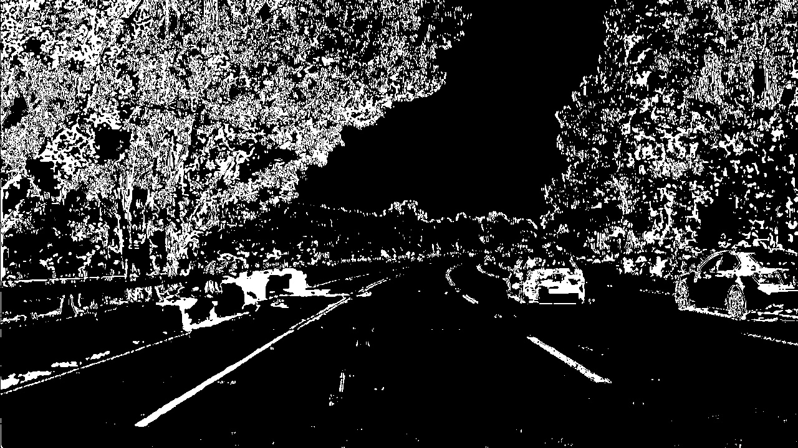

# Advanced Lane Finding Report

In this project, I build a pipeline which can detect current lane of a car and compute the lane's area, curvature. The pipeline is robust enough such that it can perform well in various color and lighting conditions of roads and lane lines

My pipeline is composed by the following steps  
    __1. Camera Calibration and Original Camera Image Undistortion__  
    __2. Mixed Technique Binary Thresholding of Undistorted Image__  
    __3. Bird View Perjection from Forward Facing Image__  
    __4. Line Search and Second Order Curve Fitting__  
    __5. Curvature Computation__  
    __6. Project Results Back to Original Camera Image__  
    
    
## Camera Calibration and Original Camera Image Undistortion
Why camera calibration?

Modern camera uses lenses and lenses introduce distortion to images.

For example:

As you can see, the chess board is curved. This is a distortion because in real life, this chess board has straight lines.

__Camera calibration__ is the process which finds how much a given camera distorts its images from real life objects. __Image Undistortion__ is the step which uses a given camera calibration information to undistort images taken by this camera.

__Each camera has its own calibration__. You can't use camera A's calibration to undistort images taken by camera B, unless camera A and B have the same calibration.

### Method
Chess board iamges are extremely useful for camera calibration, because we know the exact shape of a given chessboard and a chessboard has straing lines, which make the computation rather easy.

Our goal is to calibrate the camera which shot the driving video. Therefore, we gathered several chessboard images taken by the same camera.

             1             |            2              |             3
:-------------------------:|:-------------------------:|:-------------------------:
  |    |   
  |    |  
  |    |  

I used 20 images in total. You can find all of them in [this folder](https://github.com/CreatCodeBuild/CarND-Advanced-Lane-Lines/tree/master/camera_cal)

In __helper.py__, you can find `class Calibrator`. I use this class to do both calibration and undistortion.  

The 3 key functions are `cv2.findChessboardCorners`, `cv2.calibrateCamera` and `cv2.undistort`.

You can run `test_Calibrator` function in __test.py__ to test this class. `test_Calibrator` will write undistorted images to directory [output_images/calibration](https://github.com/CreatCodeBuild/CarND-Advanced-Lane-Lines/tree/master/output_images/calibration)

### Mixed Technique Binary Thresholding of Undistorted Image
After first step, we need to binary thresholding this image so that we remove unnecessary information from this image.

Here are some example:
  Undistored Color Image   | Binary Thresholded Image              
:-------------------------:|:-------------------------:
  |  
  |  
