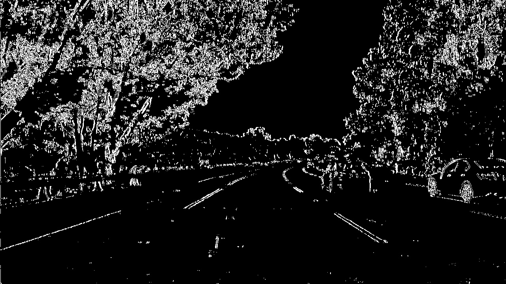

# Advanced Lane Finding Report

In this project, I build a pipeline which can detect current lane of a car and compute the lane's area, curvature. The pipeline is robust enough such that it can perform well in various color and lighting conditions of roads and lane lines

My pipeline is composed by the following steps  
    __1. Camera Calibration and Original Camera Image Undistortion__  
    __2. Mixed Technique Binary Thresholding of Undistorted Image__  
    __3. Bird View Perjection from Forward Facing Image__  
    __4. Line Search and Second Order Curve Fitting__  
    __5. Curvature Computation__  
    __6. Project Results Back to Original Camera Image__  
    
    
## Camera Calibration and Original Camera Image Undistortion
Why camera calibration?

Modern camera uses lenses and lenses introduce distortion to images.

For example:

As you can see, the chess board is curved. This is a distortion because in real life, this chess board has straight lines.

__Camera calibration__ is the process which finds how much a given camera distorts its images from real life objects. __Image Undistortion__ is the step which uses a given camera calibration information to undistort images taken by this camera.

__Each camera has its own calibration__. You can't use camera A's calibration to undistort images taken by camera B, unless camera A and B have the same calibration.

### Method
Chess board iamges are extremely useful for camera calibration, because we know the exact shape of a given chessboard and a chessboard has straing lines, which make the computation rather easy.

Our goal is to calibrate the camera which shot the driving video. Therefore, we gathered several chessboard images taken by the same camera.

             1             |            2              |             3
:-------------------------:|:-------------------------:|:-------------------------:
  |    |   
  |    |  
  |    |  

I used 20 images in total. You can find all of them in [this folder](https://github.com/CreatCodeBuild/CarND-Advanced-Lane-Lines/tree/master/camera_cal)

In __helper.py__, you can find `class Calibrator`. I use this class to do both calibration and undistortion.  

The 3 key functions are `cv2.findChessboardCorners`, `cv2.calibrateCamera` and `cv2.undistort`.

You can find the math equation at 

You can run `test_Calibrator` function in __test.py__ to test this class. `test_Calibrator` will write undistorted images to directory [output_images/calibration](https://github.com/CreatCodeBuild/CarND-Advanced-Lane-Lines/tree/master/output_images/calibration)

## Mixed Technique Binary Thresholding of Undistorted Image
After first step, we need to binary thresholding this image so that we remove unnecessary information from this image.

  Undistored Color Image   | Binary Thresholded Image              
:-------------------------:|:-------------------------:
  |  
  |  

As you can see, the thresholding is robust regardless the color, shadow and lighting of the line, road and environment.

### Method
I combined x-direction gradient threshold and S channel threshold of the HSL color space.

  Color   |  X Gradient | S Channel | Combined              
:-------------------------:|:-------------------------:|:-------------------------:|:-------------------------:
  |  |  | 
  |  |  | 

The reason to apply a combined threshold is that any single threshold technique is not robust enough to detect lines in various condition.

#### Gradient Threshold
I applied sobel operator to compute the gradient. There are x direction and y direction gradient.

 

As you can see, sobel y catches the changes along the vertical direction. That is, horizontal lines are easily catches by sobel y because horizontal lines have very different color from its surrounding vertically.

But, since lane lines need to be more vertical than horizontal, we choose sobel x as our gradient threshold.

#### Saturation Channel Threshold
Binary threshold is a powerful tool to filter useful information. But the conventional grayscale threshold has a obvious disadvantage. Colors with very different appearance in the RGB space could have the same value in grayscale. For example, after be converted to graysale, yellow is just gray. But very often our lane lines are yellow, the road is gray. We need to find a better way to separate them.

As you can see, yellow line is almost indistinguishable from the road and the threshold doesn't work well.

Of couse we can threshold R, G, B channel separately and see which channel's threshold works best for this image. But, if we are to deal with a video steam, it's hard to know which color channel works best beforehand.

A better method is to convert a RGB color sapce image to HSL color space image. HSL stands for Hue, Saturation, and Light.

Here is a explanation from Udacity's lesson:
To get some intuition about these color spaces, you can generally think of Hue as the value that represents color independent of any change in brightness. So if you imagine a basic red paint color, then add some white to it or some black to make that color lighter or darker -- the underlying color remains the same and the hue for all of these colors will be the same.

On the other hand, Lightness and Value represent different ways to measure the relative lightness or darkness of a color. For example, a dark red will have a similar hue but much lower value for lightness than a light red. Saturation also plays a part in this; saturation is a measurement of colorfulness. So, as colors get lighter and closer to white, they have a lower saturation value, whereas colors that are the most intense, like a bright primary color (imagine a bright red, blue, or yellow), have a high saturation value. You can get a better idea of these values by looking at the 3D color spaces pictured below.

Saturation is a good channel because it measures how dense color is at a certain place. Lane line will probably have denser color than road.

As you can see, S channel threshold gets a relatively complete line.

